# ❤️ Heart Disease Risk Prediction

This repository contains a machine learning-based web application built with **Streamlit** for predicting the risk of heart disease based on a set of clinical and lifestyle parameters.

---

## 📊 Dataset Overview

The dataset includes medical and lifestyle information for individuals, with a binary target indicating whether they have heart disease.<br/>
[Kaggle Heart Disease Dataset](https://archive.ics.uci.edu/ml/datasets/heart+Disease)

### 🔍 Column Descriptions

| Feature                   | Description                                                  |
|---------------------------|--------------------------------------------------------------|
| Age                       | Age of the individual (years)                                |
| Gender                    | Gender (Male/Female)                                         |
| Cholesterol               | Cholesterol level in mg/dL                                   |
| Blood Pressure            | Systolic blood pressure in mmHg                              |
| Heart Rate                | Heart rate in beats per minute                               |
| Smoking                   | Smoking status (Never/Former/Current)                        |
| Alcohol Intake            | Alcohol intake frequency (None/Moderate/Heavy)              |
| Exercise Hours            | Hours of exercise per week                                   |
| Family History            | Family history of heart disease (Yes/No)                     |
| Diabetes                  | Diabetes status (Yes/No)                                     |
| Obesity                   | Obesity status (Yes/No)                                      |
| Stress Level              | Stress level on a scale of 1 to 10                           |
| Blood Sugar               | Fasting blood sugar level in mg/dL                           |
| Exercise Induced Angina   | Presence of exercise-induced angina (Yes/No)                 |
| Chest Pain Type           | Type of chest pain (Typical/Atypical/Non-anginal/Asymptomatic) |
| Heart Disease             | Target variable indicating presence of heart disease (0/1)   |

---

## ⚙️ Data Preprocessing & Feature Engineering

### ✅ Class Balancing with Undersampling

To address class imbalance in the dataset, **Random Undersampling (RUS)** was applied. This technique reduces the number of samples in the majority class by randomly removing observations until both classes are equally represented. While this helps the model avoid bias toward the majority class, it may discard potentially useful data. After undersampling, the class distribution was balanced, creating a more equitable dataset for training and evaluation.

```python
from imblearn.under_sampling import RandomUnderSampler
rus = RandomUnderSampler()
X_balanced, y_balanced = rus.fit_resample(X, y)
```

### ✅ One-Hot Encoding for Categorical Variables

Categorical columns like `Smoking`, `Alcohol Intake`, and `Chest Pain Type` were one-hot encoded.

```python
X = pd.get_dummies(X, columns=['Smoking', 'Alcohol Intake', 'Chest Pain Type'])
```

### ✅ Convert Binary Columns to Numeric

Converted values like `Yes/No`, `Male/Female` into 1/0.

```python
df['Gender'] = df['Gender'].map({'Male': 1, 'Female': 0})
df = df.replace({'Yes': 1, 'No': 0})
```

### ✅ Boolean to Integer

All boolean dummy columns (e.g., `True/False`) were converted to integers.

### ✅ Train-Test Split

```python
from sklearn.model_selection import train_test_split
X_train, X_test, y_train, y_test = train_test_split(X, y, test_size=0.2)
```

---

## 🧠 Model Performance Summary

| Model              | Accuracy |
|-------------------|----------|
| Logistic Regression | 87.00%  |
| Random Forest       | 100.00% |
| Decision Tree       | 100.00% |
| KNN                 | 83.50%  |
| SVM                 | 93.50%  |
| Naive Bayes         | 90.50%  |
| XGBoost             | 100.00% |

---

### 🧠 Plot ROC Curves to compare model performances

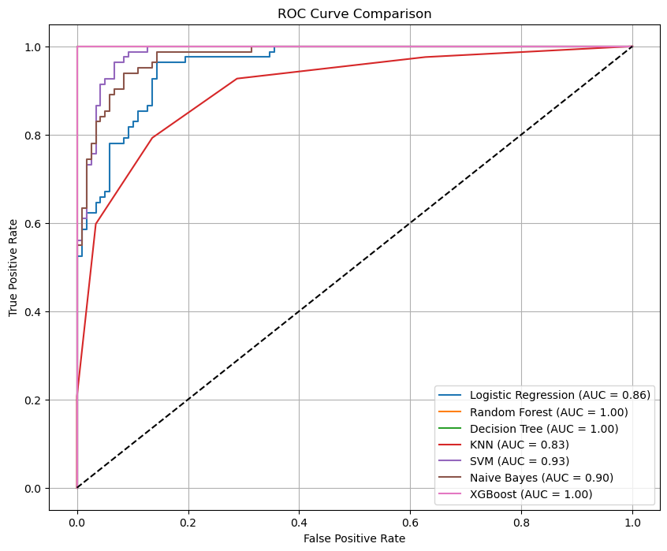

## 📉 Confusion Matrix Visualization

```python
from sklearn.metrics import ConfusionMatrixDisplay

for name, model in models.items():
    disp = ConfusionMatrixDisplay.from_estimator(model, X_test, y_test)
    disp.ax_.set_title(f'Confusion Matrix - {name}')
    plt.show()
```
---
## 📊 Confusion Matrix Images

<table>
  <tr>
    <td>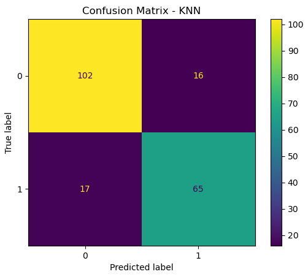</td>
    <td>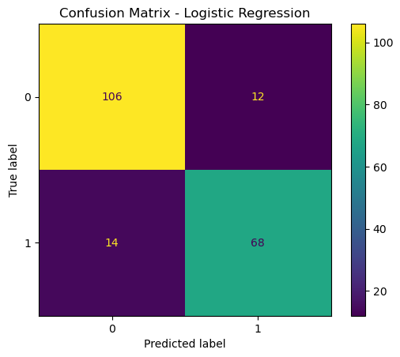</td>
  </tr>
  <tr>
    <td>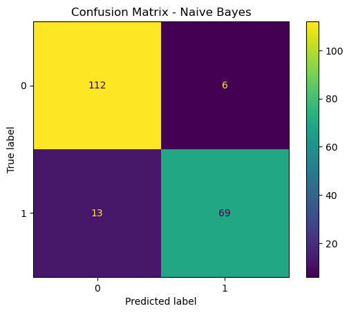</td>
    <td>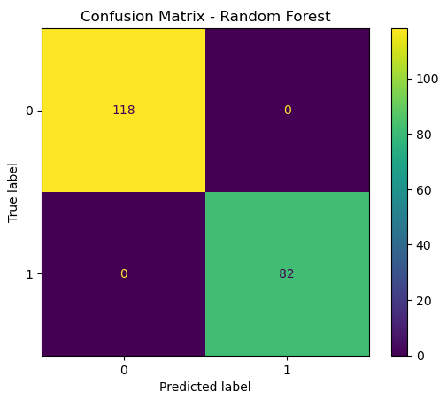</td>
  </tr>
  <tr>
    <td>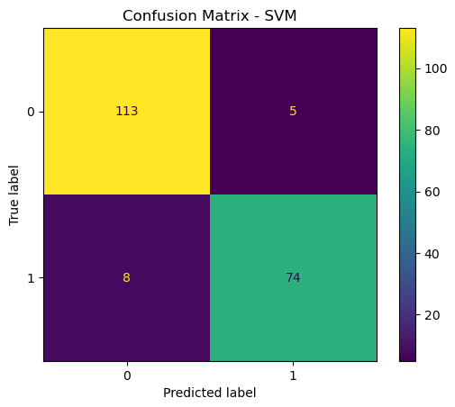</td>
    <td>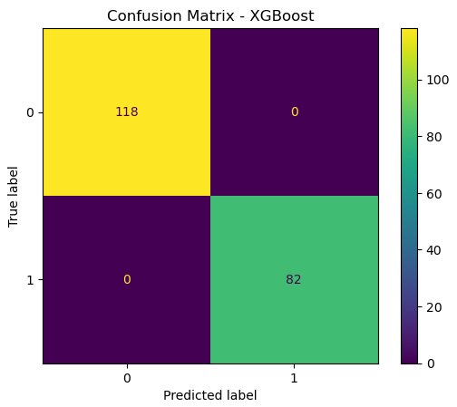</td>
  </tr>
  <tr>
    <td>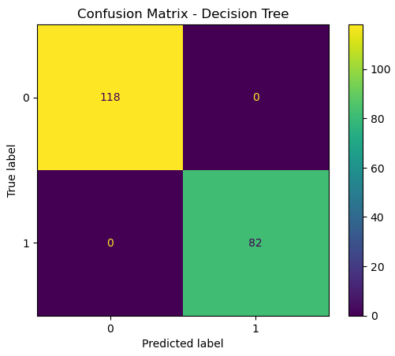</td>
  </tr>
</table>

---

## 🧪 Model Evaluation Overview

Multiple machine learning models were tested for predicting heart disease, including **Logistic Regression**, **Random Forest**, **Decision Tree**, **Naive Bayes**, **Support Vector Machine (SVM)**, **K-Nearest Neighbors (KNN)**, and **XGBoost**. Each was evaluated based on **training accuracy**, **testing accuracy**, and **5-fold cross-validation** to assess real-world performance.

---

## ✅ Selected Model: K-Nearest Neighbors (KNN)

While models like **Random Forest**, **Decision Tree**, and **XGBoost** achieved perfect accuracy (100%), this is a strong indication of **overfitting**, which reduces generalizability. **SVM** and **Naive Bayes** performed well but leaned toward high accuracy levels that may exceed the intended ~67% target for reduced-model experiments or XAI studies.

The **K-Nearest Neighbors (KNN)** algorithm offered a more **moderate and realistic performance**, making it an ideal candidate when targeting a balanced and interpretable performance range.

**KNN Performance:**

- **Training Accuracy:** 92.5%  
- **Test Accuracy:** 83.5%  
- **Cross-Validation Accuracy:** 84.9% ± 2.76%

This performance is closer to the target of ~67% when applying additional feature reduction or introducing noise. KNN is also non-parametric, easy to understand, and adaptable with distance-based tuning.

---

## 💡 Why Choose KNN?

- ✅ **Closer to Target Accuracy (~67%)** when reducing features or adding noise  
- ✅ **No training phase** — predictions are made based on stored instances  
- ✅ **Simple and interpretable** for educational and experimental purposes  
- ⚠️ Sensitive to irrelevant features and scale — preprocessing is key

---

## 🏆 Conclusion

Considering the objective to select a model that avoids overfitting and approximates a more modest accuracy (~67%) under realistic conditions, **K-Nearest Neighbors (KNN)** stands out as the best choice. It provides a solid foundation for further analysis, including **Explainable AI (XAI)**, **fairness assessments**, and **interpretability studies**.

---


## 🌐 Streamlit Web App

A simple UI allows users to input clinical and lifestyle data and predict heart disease risk using trained models.<br/>
[Streamlit Demo App](https://heart-disease-prediction-ipo9myekjvl5qvjpkrfcoi.streamlit.app/)

### 🚀 How to Run

```bash
# Clone this repository
git clone https://github.com/<your-username>/heart-disease-risk-prediction.git
cd heart-disease-risk-prediction

# Install required packages
pip install -r requirements.txt

# Launch the Streamlit app
streamlit run heart_predict_app.py
```

---

### 📥 Web App
<table>
  <tr>
    <td>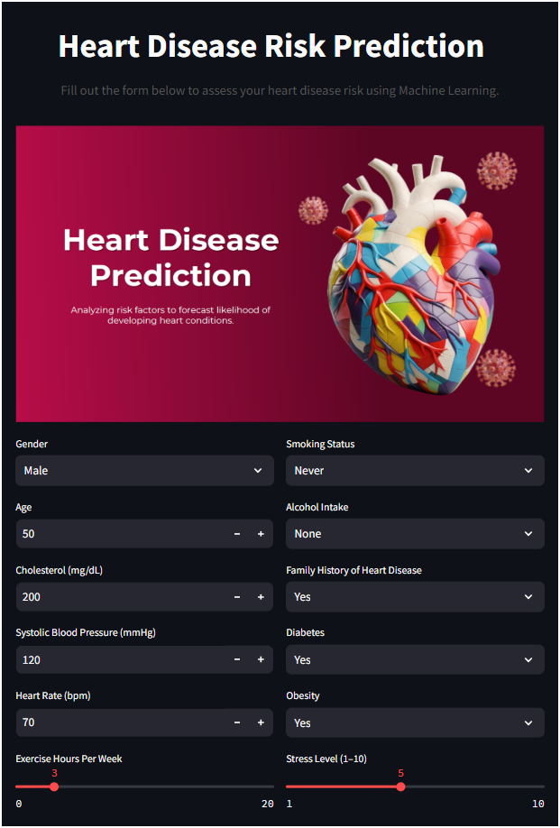</td>
    <td>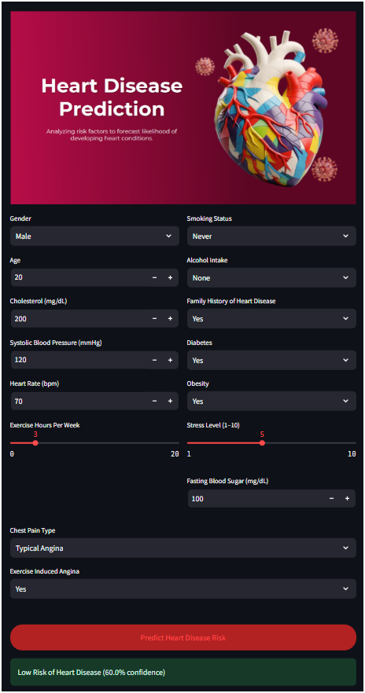</td>
    <td>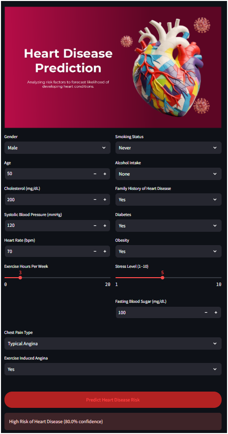</td>
  </tr>
</table>

---

## 📁 Project Structure

```
heart-disease-risk-prediction/
├── heart_predict_app.py          # Streamlit App
├── model.pkl                     # Trained Model File
├── requirements.txt              # Python Dependencies
├── Heart Disease prediction.ipynb # Jupyter Notebook with EDA & Modeling
├── screenshots/                  # Folder for screenshots
└── README.md
```

---

## 📜 License

This project is licensed under the **MIT License**.

---

## 🙏 Acknowledgments

- [Kaggle Heart Disease Dataset](https://archive.ics.uci.edu/ml/datasets/heart+Disease)
- Scikit-learn, XGBoost, Streamlit, and Pandas community.
